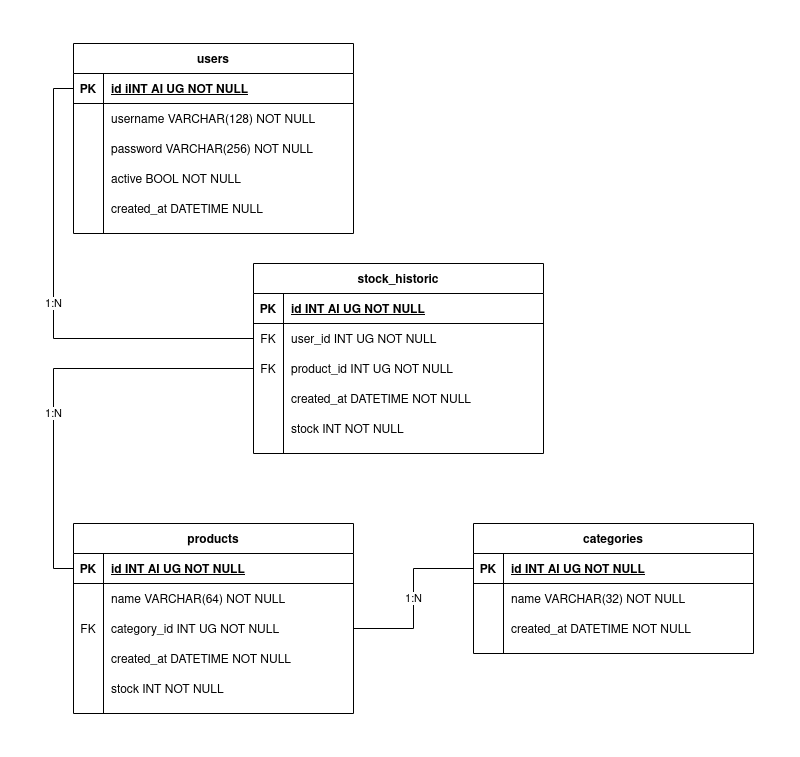

# Descripción de la prueba técnica
Desarrollar una aplicación que gestione el stock de una serie de productos. La aplicación permitirá:
- Listar, crear y modificar usuarios.
- Listar, crear y modificar categorías de productos.
- Listar, crear y modificar productos.
- Modificación de stock sobre los productos *(añadir o eliminar cierta cantidad de productos disponibles)*.
- Histórico de cambios de stock.
- Autenticación de usuarios para acceder al sistema.

Antes de comenzar con la prueba técnica, leer y comprendender todos los puntos de este README.
## Evaluación
Se evaluarán los siguientes aspectos técnicos:
- Conocimientos en GIT.
- Conocimientos en Symfony 5.3 y el patrón MVC.
- Conocimientos en Doctrine, gestión de entidades y migracines bajo MySQL 8.0.
- Uso de la consola de Symfony. [Más info](https://symfony.com/doc/current/components/console.html).
- Reutilización de plantillas HTML.
- Desarrollo ágil.
### Evaluación opcional
- Carga de productos mediante fixtures y obtención de datos vía API.
## Depedencias
- PHP 8.0
- MySQL 8.0
- Binario de Symfony. [Más info](https://symfony.com/download).
- Cuenta en GitHub.
## Descripción técnica
1. Realizar un fork del repositorio e inicializar la aplicación.
2. Partiendo del siguiente esquema relacional, generar las entidades y migraciones pertinentes.



A continuación se describen las entidades y cada uno de sus campos:
- `users`: Usuarios con acceso al sistema.
    - `id`: Identificador unívoco autoincremental sin signo.
    - `username`: Nombre de usuario.
    - `password`: Contrasña de acceso encriptada.
    - `active`: Indica si el usuario tiene acceso, o no, al sistema.
    - `created_at`: Momento en el que el registro se da de alta en el sistema.
- `categories`: Categorías de productos disponibles en el sistema.
    - `id`: Identificador unívoco autoincremental sin signo.
    - `name`: Nombre de la categoría.
    - `created_at`: Momento en el que el registro se da de alta en el sistema.
- `products`: Productos disponibles en el sistema.
    - `id`: Identificador unívoco autoincremental sin signo.
    - `name`: Nombre descriptivo del producto.
    - `category_id`: Categoría al que pertenece el producto.
    - `created_at`: Momento en el que el registro se da de alta en el sistema.
    - `stock`: Cantidad total de productos disponibles.
- `stock_historic`: Registra todos los cambios de stock de los productos.
    - `id`: Identificador unívoco autoincremental sin signo.
    - `user_id`: Usuario que realilza la modificación de stock.
    - `product_id`: Producto al que se le ha modificado el stock.
    - `created_at`: Momento en el que el registro se da de alta en el sistema.
    - `stock`: Cantidad de productos añadidos o eliminados del stock.

3. Generar el CRUD de la entidad `users`. La ruta de acceso deberá ser pública, permitiendo el registro a cualquier usuario sin cuenta.
4. Implementar la autenticación de usuarios con el componente `Access Control (Authorization)` de Symfony. Solo existirá un rol de administrador (`ROLE_ADMIN`). [Más info](https://symfony.com/doc/current/security.html#access-control-authorization).
5. Generar el CRUD de las entidades `categories` y `products` y hacerlas accesible desde la interfaz de usuario. Las rutas de acceso deberán de estar tras un firewall ([Más info](https://symfony.com/doc/current/security.html#the-firewall)) permitiendo el acceso únicamente a usuarios con rol `ROLE_ADMIN`. No es necesario la eliminación de los registros.
6. Implementar la funcionalidad de modificación de stock de productos. Para ello generar un formulario que solicite la cantidad de stock a añadir o eliminar *(deberá de permitir negativos y no se podrá eliminar más stock del existente)* al que se accederá desde un botón de acción de la lista de productos.
7. Implementar el histórico de stock para controlar todos los movimientos de stock de los productos. El control de stock deberá de ser manejado en un evento que se disparará cuando el campo `stock` de `products` se vea modificado. Este evento almacenará un nuevo registro `stock_historic` con el usuario que realilza la gestión y la cantidad de productos añadidos o consumidos. El acceso al histórico de cada producto se realizará mediante un botón de acción de la lista de productos.
8. Subir los cambios al repositorio.

Para agilizar el desarrollo de la aplicación, el repositorio incluye un template HTML dentro de la carpeta `template` que deberá ser utilizado para montar la interfaz de usuario. El template no dispone de todas las pantallas de la aplicación para poder evaluar la capacidad de reutilización de plantillas HTML.

Todos los formulario deberán ser manejados y validados con los `Forms` de Symfony. [Más info](https://symfony.com/doc/current/forms.html).
### Descripción técnica evaluación opcional
Generar una [fixture](https://symfony.com/bundles/DoctrineFixturesBundle/current/index.html) para cada entidad (`users`, `categories` y `products`) que cargue datos de prueba de forma automática utilizando la API `fakestoreapi`. [Más info](https://fakestoreapi.com/).

Las llamadas HTTP deberán de realizarse con la librería `HTTP client` de Symfony. [Más info](https://symfony.com/doc/current/http_client.html)

## Información de utilidad
### Symfony Local Web Server
Symfony proporciona un servidor web para el entorno de desarrollo. 
Si tienes varias versiones de PHP instaladas en tu equipo, puedes decirle a Symfony cuál usar. Para ello, creaa un archivo llamado `.php-version` en el directorio raíz del proyecto con la versión a utilizar:
```
echo 8.0.6 > .php-version
```
Ejecute el siguiente comando si no recuerda todas las versiones de PHP instaladas en tu equipo:
```
symfony local:php:list

```
Una vez configurada la versión de PHP a utilizar, puede ejecutar el servidor web:
```
symfony server:start
```
### Maker Bundle
Se permite el uso del paquete `maker` de Symfony sin ningún tipo de restricción.
```
symfony console list make
```